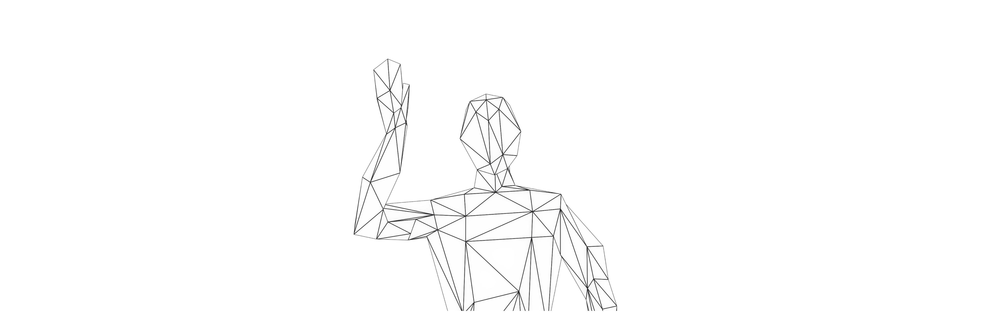
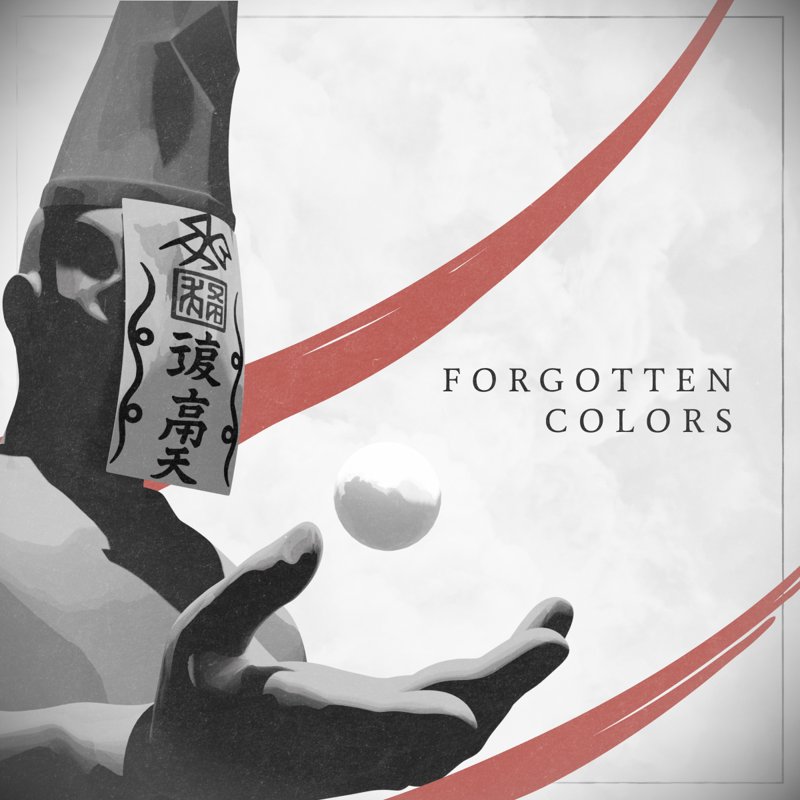
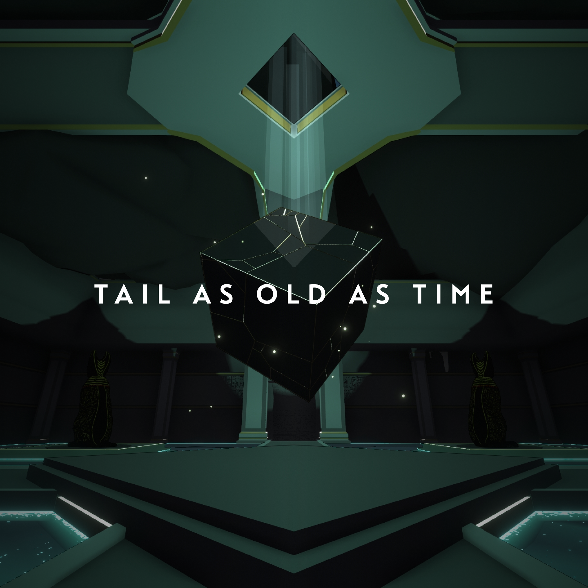

<!-- ===== HERO / BANNER (optional) =====
Place a banner image in your repo and point src to it.
For full-width: width="100%" height="auto"
-->

  
<!-- ===== SOCIAL ICONS (centered) ===== -->

  <a href="https://www.youtube.com/@bentoBAUX">
    <picture>
      <source media="(prefers-color-scheme: dark)" srcset="https://cdn.simpleicons.org/youtube/ffffff">
      
    </picture>
  </a>
  &#8287;&#8287;&#8287;&#8287;&#8287;
  <a href="https://www.linkedin.com/in/bennettpoh">
    <picture>
      <source media="(prefers-color-scheme: dark)" srcset="assets/icons/linkedin-white.png">
      
    </picture>
  </a>
  &#8287;&#8287;&#8287;&#8287;&#8287;
  <a href="https://github.com/bentoBAUX">
    <picture>
      <source media="(prefers-color-scheme: dark)" srcset="https://cdn.simpleicons.org/github/ffffff">
      
    </picture>
  </a>
  &#8287;&#8287;&#8287;&#8287;&#8287;
  <a href="https://www.artstation.com/bentobaux">
    <picture>
      <source media="(prefers-color-scheme: dark)" srcset="https://cdn.simpleicons.org/artstation/ffffff">
      
    </picture>
  </a>
  &#8287;&#8287;&#8287;&#8287;&#8287;
  <a href="https://instagram.com/bentobaux">
    <picture>
      <source media="(prefers-color-scheme: dark)" srcset="https://cdn.simpleicons.org/instagram/ffffff">
      
    </picture>
  </a>

<strong>Technical Artist &amp; Graphics Programmer — Bridging Art and Code</strong>

Hello! I am a computer science student specialising in real-time rendering and shader development, combining technical expertise with 3D art experience to bridge artists and engineers.

## Currently
- Developing shaders and rendering systems in Unity and Vulkan  
- Exploring advanced real-time graphics techniques

## Featured Projects

<!-- Thumbnails: put your images in /assets/featured and keep alt text short. 
     The 
 trick keeps the layout image-only (no table borders). -->

  
  

**Forgotten Colors** — Stylised sumi-e puzzle platformer  
**Tail as Old as Time** — Exploration puzzle game showcasing a custom HLSL toon shader

## Tools & Technologies
<!-- TOOLS-START -->
<!-- This block can be auto-updated by a GitHub Action.
     Paste initial badges manually, or leave "Loading…" until your action writes them. -->

<!-- TOOLS-END -->

## Learning
Vulkan, Subsurface Scattering

---

